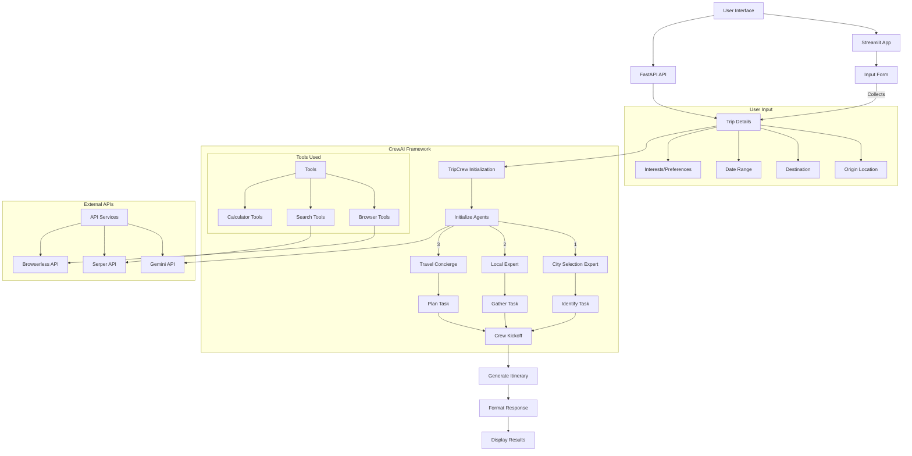

# AI Trip Planner

## Project Description

This project is an AI-powered trip planner built using CrewAI, Streamlit, and FastAPI. It helps users plan their dream trips by taking inputs such as origin city, desired cities, date range, and interests, and then generates a detailed trip plan. It provides both a web-based user interface and a programmatic API.

## Technologies Used

*   **Python**: The core programming language.
*   **CrewAI**: A framework for orchestrating role-playing, autonomous AI agents.
*   **Streamlit**: For building the interactive web application user interface.
*   **FastAPI**: For creating the RESTful API.
*   **Uvicorn**: An ASGI server to run the FastAPI application.
*   **python-dotenv**: To manage environment variables (like API keys).
*   **requests**: For making HTTP requests (used by `SearchTools`).
*   **Google Fonts**: For modern typography (Inter font).
*   **Bootstrap 5**: For a modern and responsive UI design.
*   **Mermaid**: For diagramming the project's workflow.
*   **Docker**: For containerizing the application.
*   **GitHub Actions**: For Continuous Integration and Continuous Deployment (CI/CD).
*   **Azure Container Instances (ACI)**: For deploying the containerized API.
*   **Hugging Face Spaces**: For deploying the FastAPI API as a demo.

## Project Schema (CrewAI Workflow)



## How to Use the Application

### 1. Prerequisites

*   Python 3.10 or higher
*   Docker Desktop (for local Docker development)
*   An Azure account and Azure CLI (for ACI deployment)
*   A Hugging Face account (for Hugging Face Spaces deployment)
*   A valid Google Gemini API Key
*   A valid Serper API Key (for search functionality)
*   A valid Browserless API Key (for browser tools)

### 2. Setup

1.  **Clone the repository (if applicable):**
    ```bash
    git clone <your-repo-url>
    cd trip_planner
    ```

2.  **Create a virtual environment (recommended):**
    ```bash
    python -m venv .venv
    ```

3.  **Activate the virtual environment:**
    *   On Windows:
        ```bash
        .venv\Scripts\activate
        ```
    *   On macOS/Linux:
        ```bash
        source .venv/bin/activate
        ```

4.  **Install dependencies:**
    ```bash
    pip install -e .
    pip install streamlit python-dotenv fastapi uvicorn
    ```

5.  **Configure Environment Variables:**
    Create a `.env` file in the root directory of the project (`C:/Users/Asus_M/Documents/trip_planner/.env`) and add your API keys:
    ```dotenv
    MODEL=gemini/gemini-1.5-flash
    GEMINI_API_KEY=YOUR_GEMINI_API_KEY
    SERPER_API_KEY=YOUR_SERPER_API_KEY
    BROWSERLESS_API_KEY=YOUR_BROWSERLESS_API_KEY
    ```
    Replace `YOUR_GEMINI_API_KEY`, `YOUR_SERPER_API_KEY`, and `YOUR_BROWSERLESS_API_KEY` with your actual keys.

### 3. Run the Streamlit Application

Once the setup is complete, run the Streamlit application from the project root directory:

```bash
streamlit run app.py
```

This will open the application in your default web browser.

### 4. Run the FastAPI API Locally

To run the API locally, navigate to the project root directory and execute:

```bash
uvicorn api_app:app --reload
```

The API will be available at `http://127.0.0.1:8000`.

*   **Interactive Documentation (Swagger UI)**: `http://127.0.0.1:8000/docs`
*   **Health Check**: `http://127.0.0.1:8000/health`

#### API Endpoint: `/plan_trip` (POST)

This endpoint generates a trip plan based on the provided details.

**Request Body (JSON):**

```json
{
  "origin": "Paris",
  "cities": "Rome, Florence",
  "date_range": "2025-09-01 to 2025-09-10",
  "interests": "history, art, food"
}
```

**Response (JSON):**

```json
{
  "status": "success",
  "trip_plan": "# Your Trip Plan\n\n... (Markdown content of the trip plan) ..."
}
```

## CI/CD with GitHub Actions and Azure Container Instances

This project is configured for Continuous Integration and Continuous Deployment (CI/CD) using GitHub Actions to build a Docker image of the FastAPI application and deploy it to Azure Container Instances (ACI).

### Dockerization

The `Dockerfile` at the root of the project defines how the FastAPI application is containerized. The `.dockerignore` file ensures that unnecessary files are not included in the Docker image, keeping it lean and secure.

### GitHub Actions Workflow

The CI/CD pipeline is defined in `.github/workflows/docker-build-push.yml`. This workflow is triggered on every push to the `main` branch and performs the following steps:

1.  **Build and Push Docker Image**: The FastAPI application is built into a Docker image and pushed to Docker Hub (or your configured container registry).
2.  **Deploy to Azure Container Instances (ACI)**: The newly built Docker image is then deployed to ACI. This step uses Azure credentials configured as GitHub Secrets to authenticate and manage resources in your Azure subscription.

### Azure Setup for CI/CD

To enable deployment to ACI via GitHub Actions, you need to perform the following one-time setup in your Azure subscription:

1.  **Create an Azure Resource Group**: A logical container for your Azure resources.
    ```bash
    az group create --name <YOUR_RESOURCE_GROUP_NAME> --location <YOUR_PREFERRED_LOCATION>
    ```

2.  **Create an Azure Service Principal**: This provides GitHub Actions with the necessary permissions to deploy to your Azure resources. Make sure to copy the entire JSON output.
    ```bash
    az ad sp create-for-rbac --name "github-actions-trip-planner" --role contributor --scopes /subscriptions/<YOUR_SUBSCRIPTION_ID>/resourceGroups/<YOUR_RESOURCE_GROUP_NAME> --json-auth
    ```

### GitHub Secrets Configuration

For the CI/CD pipeline to function correctly, you must add the following secrets to your GitHub repository (Settings > Secrets and variables > Actions):

*   `AZURE_CREDENTIALS`: The full JSON output from creating the Azure Service Principal.
*   `AZURE_RESOURCE_GROUP`: The name of your Azure Resource Group (e.g., `my-trip-planner-rg`).
*   `DOCKER_USERNAME`: Your Docker Hub username.
*   `DOCKER_PASSWORD`: Your Docker Hub password or a Personal Access Token.
*   `GEMINI_API_KEY`: Your Google Gemini API Key.
*   `SERPER_API_KEY`: Your Serper API Key.
*   `BROWSERLESS_API_KEY`: Your Browserless API Key.
*   `MODEL`: The model name used by CrewAI (e.g., `gemini/gemini-1.5-flash`).

## Deployment to Hugging Face Spaces

This section outlines how to deploy your FastAPI API as a Hugging Face Space, providing a public demo of your application.

### 1. Prepare the Application for Hugging Face Spaces

Create a new directory (e.g., `hf_space_app`) at the root of your project. This directory will contain the files specifically prepared for Hugging Face Spaces.

1.  **Copy and Rename `api_app.py`**: Copy your `api_app.py` to `hf_space_app/app.py`. Hugging Face Spaces expects the main application file to be named `app.py`.
    ```bash
    cp api_app.py hf_space_app/app.py
    ```

2.  **Copy `src/` Directory**: Copy your entire `src/` directory into `hf_space_app/`.
    ```bash
    cp -r src/ hf_space_app/src/
    ```

3.  **Create `output/` Directory**: Create an `output/` directory inside `hf_space_app/` if it doesn't exist.
    ```bash
    mkdir -p hf_space_app/output
    ```

4.  **Generate `requirements.txt`**: Navigate into `hf_space_app/` and generate a `requirements.txt` file containing only the dependencies required for the FastAPI API.
    ```bash
    cd hf_space_app/
    pip freeze > requirements.txt
    cd .. # Go back to the project root
    ```
    *Review `requirements.txt` and remove any unnecessary dependencies (e.g., `streamlit`).*

5.  **Modify `hf_space_app/app.py`**: Remove the `from dotenv import load_dotenv` and `load_dotenv()` lines from `hf_space_app/app.py`. Hugging Face Spaces manages environment variables via Space secrets.
    ```bash
    # From the project root directory
    python -c "import re; \
    with open('hf_space_app/app.py', 'r') as f: content = f.read(); \
    content = re.sub(r'from dotenv import load_dotenv\\n\\n# Load environment variables from .env file\\nload_dotenv\\(\\)', '', content); \
    with open('hf_space_app/app.py', 'w') as f: f.write(content)"
    ```

6.  **Create `Procfile`**: Create a file named `Procfile` (no extension) in `hf_space_app/` with the following content:
    ```
    web: uvicorn app:app --host 0.0.0.0 --port $PORT
    ```

### 2. Create a Hugging Face Space

1.  Go to [huggingface.co/spaces](https://huggingface.co/spaces).
2.  Click on "Create new Space".
3.  Provide a name for your Space (e.g., `my-trip-planner-api`).
4.  Choose a license.
5.  Select "Python" as the SDK.
6.  Choose "No SDK" as the Space type.
7.  Click "Create Space".

### 3. Push Your Code to the Space

After creating the Space, Hugging Face will provide instructions to clone its Git repository.

1.  **Clone your Space's repository locally**: 
    ```bash
    git clone https://huggingface.co/spaces/<your-username>/<your-space-name>
    cd <your-space-name>
    ```

2.  **Copy the prepared files**: Copy all contents from your `hf_space_app/` directory into the newly cloned local Space repository.
    ```bash
    # From the project root directory
    cp -r hf_space_app/* <path-to-your-local-space-repo>/
    ```

3.  **Add, Commit, and Push**: From within your local Space repository, add, commit, and push the changes.
    ```bash
    git add .
    git commit -m "Initial FastAPI app deployment"
    git push
    ```

### 4. Configure Space Secrets

Your API keys and other sensitive information must be configured as "Space secrets" on Hugging Face.

1.  Go to your Space's page on Hugging Face.
2.  Click on the "Settings" tab.
3.  Scroll down to the "Space secrets" section.
4.  Add each API key as a secret, using the exact same name as in your code (e.g., `GEMINI_API_KEY`, `SERPER_API_KEY`, `BROWSERLESS_API_KEY`, `MODEL`).

### 5. Monitor Deployment

After pushing your code and configuring secrets, your Space will begin building and deploying your application. You can monitor the progress and view logs in the "Logs" tab of your Space. Once successfully deployed, your API will be accessible via your Space's URL (e.g., `https://<your-username>-<your-space-name>.hf.space/`), and you can append `/docs` to access the interactive Swagger UI.

## Code Structure

```
trip_planner/
├── app.py                  # Streamlit web application interface
├── api_app.py              # FastAPI application for programmatic access
├── pyproject.toml          # Project metadata and dependencies
├── README.md               # This file
├── .env                    # Environment variables (API keys)
├── Dockerfile              # Docker build instructions for the FastAPI app
├── .dockerignore           # Files to ignore when building Docker image
├── output/
│   └── report.md           # Generated trip plan reports
├── .github/
│   └── workflows/
│       └── docker-build-push.yml # GitHub Actions workflow for CI/CD
└── hf_space_app/           # Directory for Hugging Face Spaces deployment
    ├── app.py              # FastAPI app for HF Spaces (renamed from api_app.py)
    ├── requirements.txt    # Dependencies for HF Spaces deployment
    ├── Procfile            # Instructions for HF Spaces to run the app
    ├── src/                # Copied source code
    └── output/             # Output directory for reports
└── src/
    └── trip_planner/
        ├── __init__.py
        ├── crew.py           # Defines CrewAI agents and tasks
        ├── main.py           # Entry point for the CrewAI process
        ├── config/
        │   └── cities.py     # (Currently empty) For city-related configurations
        └── tools/
            ├── __init__.py
            ├── search_tools.py # Custom tool for internet search
            └── ...             # Other tools (browser_tools, calculator_tools)
```
